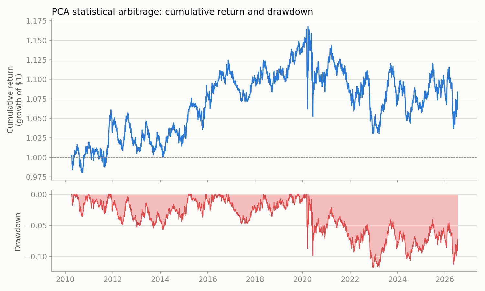

# PCA Statistical Arbitrage

Reimplementation of Avellaneda & Lee (2010), "Statistical Arbitrage in the
U.S. Equities Market," tested on 2010–2026 daily data. The original paper
studied 1997–2007, so everything here is out of sample relative to their
results.

The idea: run PCA on the return correlation matrix of a large-cap
cross-section to get statistical risk factors (eigenportfolios), regress each
stock's returns on those factors, and model the cumulative residual as an
Ornstein-Uhlenbeck process. When a stock's residual is far from its
equilibrium (|s-score| > 1.25), bet on reversion; close when it comes back
(|s| < 0.5). Each position is factor-hedged so the book carries idiosyncratic
risk only.

Full narrative with plots: [notebooks/walkthrough.ipynb](notebooks/walkthrough.ipynb)

## Results

2010–2026, 80 large-caps across all 11 GICS sectors, weekly refit on a
trailing 60-day window, 5 bps one-way transaction costs. 820 rebalances,
~28 active positions on average.

| | |
|---|---|
| Annualized Sharpe | 0.13 (90% bootstrap CI: -0.24 to 0.50) |
| Max drawdown | -11.8% |
| P(mean daily return ≤ 0) | 0.30 (block bootstrap) |
| Signal-permutation null Sharpe | -0.73 ± 0.20 (real strategy: p = 0.0 across 20 permutations) |
| Sharpe by sub-period | 2010–13: 0.11, 2014–17: 0.62, 2018–21: -0.02, 2022–26: 0.02 |



Two conclusions, and they differ:

1. **The strategy doesn't reliably make money.** The Sharpe CI spans zero,
   and across six configuration variants in `run_robustness.py` (daily refit,
   fixed factor count, the paper's 252/60 window split, perturbed variance
   thresholds — each a full walk-forward rerun) the Sharpe ranges from -0.23
   to +0.15. The sign depends on configuration, which is what a marginal
   strategy looks like.
2. **The signal is real.** A permutation test that shuffles which stock gets
   which s-score — keeping turnover, costs, and hedge structure identical —
   loses money on average (Sharpe ≈ -0.73). The real signal beats that null
   by 4–5 standard deviations. Residual mean reversion exists; after 2018 it
   is just too weak to survive realistic transaction costs.

The sub-period decay matches the documented crowding of classical stat arb
since the early 2010s, which is what you'd expect from replicating a
published strategy 15 years later. Details and failure modes are in the
notebook.

## Method notes

- **Walk-forward throughout.** Every parameter (PCA loadings, factor betas,
  OU fits) is estimated on a trailing window ending the day before it's
  traded. Signals use data through the close of day t-1 and earn day t's
  return.
- **OU estimation is just OLS.** The exact discrete-time solution of an OU
  process is an AR(1), so mean-reversion speed, half-life, and equilibrium
  variance come from regressing X_t on X_{t-1}. Names with a fitted half-life
  over 15 trading days aren't traded — a 60-day window can't estimate
  reversion that slow.
- **The hedge is two matrix products.** `holdings = p - (p @ B) @ Q` where p
  is the stock-leg weights, B the factor betas, Q the eigenportfolio weights.
  A test verifies the resulting book has near-zero exposure to every factor.
- **Estimators are tested against synthetic ground truth.** The tests plant a
  known factor structure and a known OU process, then assert the PCA and
  AR(1) fits recover the true parameters. A bug in estimation can't silently
  produce a plausible-looking backtest.
- **Negative results are in the repo, not just the good config.** Daily
  refitting doubles cost drag (2.1% → 4.9%/yr) and flips the Sharpe negative.
  So does a fixed 5-factor model, and so does the paper's own 252/60 window
  split on this sample. All recorded in `results/robustness.json`.

## Repo structure

```
src/
  universe.py     cross-sector large-cap universe
  data.py         price download + parquet cache (yfinance)
  factors.py      PCA eigenportfolios, factor regression, residuals
  signal.py       OU fit (AR1), s-scores, trading state machine
  backtest.py     walk-forward loop, factor-hedged holdings, costs
  stats.py        block bootstrap, signal-permutation test
  plots.py        result plots
run_analysis.py   end-to-end: backtest -> validation -> plots -> summary.json
run_robustness.py all configuration variants (~8 min)
tests/            estimator recovery + hedge factor-neutrality tests
notebooks/        walkthrough.ipynb
results/          plots, summary.json, robustness.json, daily_returns.csv
```

## Reproducing

```
pip install -r requirements.txt
python -m src.data          # download + cache prices
python run_analysis.py      # backtest + validation, writes results/
python run_robustness.py    # config variants
python tests/test_factors.py && python tests/test_signal.py && python tests/test_backtest.py
```

## References

- M. Avellaneda & J.-H. Lee, *Statistical Arbitrage in the U.S. Equities
  Market*, Quantitative Finance 10(7), 2010
